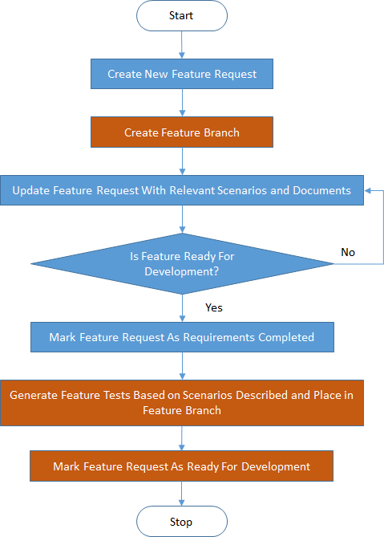

<<<<<<< HEAD
SIMON 
=====

SIMON stands for SIMple OperatioNs. It is an ALM tool with Continuous delivery management support. It provides a simple yet definitive structure to a software development life cycle.

PS: This project is still in active development.
=======
# SIMON  #

SIMON or SIMplified OperatioNs, is an Application Life-cycle Management (ALM) tool with Continuous delivery management support. It provides a simple yet definitive structure to a software development life cycle.

The idea is to build an ALM tool with minimum to no configuration which is functional out-of-the-box.

Note: This project is still in active development.

## Entity Hierarchy: ##

## Processes: ##

### Legend: ###

### New Feature Request: ###

### New Feature Development: ###

>>>>>>> Readme updates and minimal file changes.
