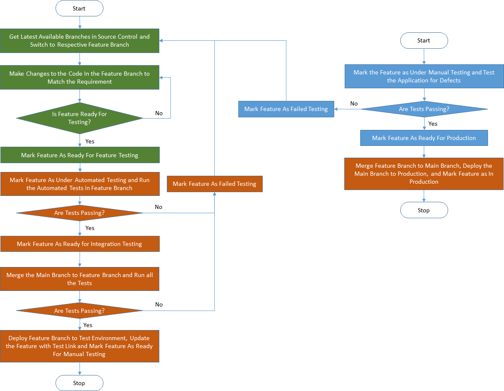

# SIMON  #

SIMON or SIMplified OperatioNs, is an Application Life-cycle Management (ALM) tool with Continuous delivery management support. It provides a simple yet definitive structure to a software development life cycle.

The idea is to build an ALM tool with minimum to no configuration which is functional out-of-the-box.

Note: This project is still in active development.

## Entity Relationship and Hierarchy: ##

## Processes: ##

Note: Even production defects are considered as features as that would simplify the process and make it uniform.

### Legend: ###

### New Feature Request: ###

### New Feature Development and Deployment: ###

More processes will be added soon . . .
